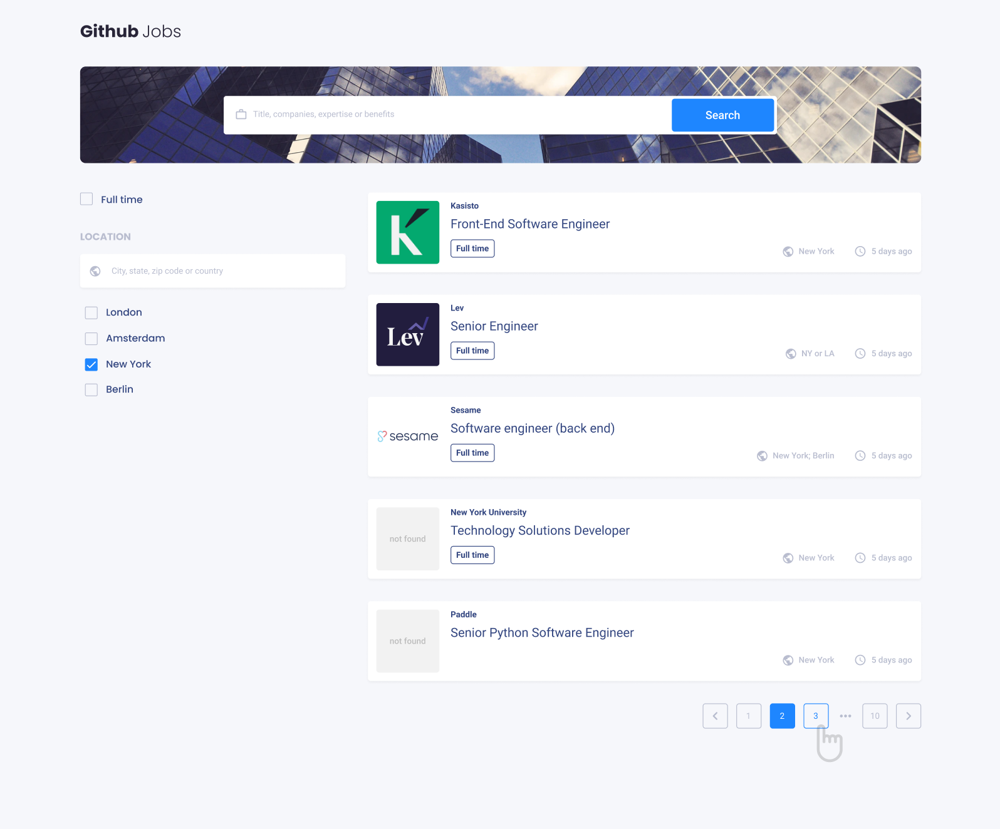
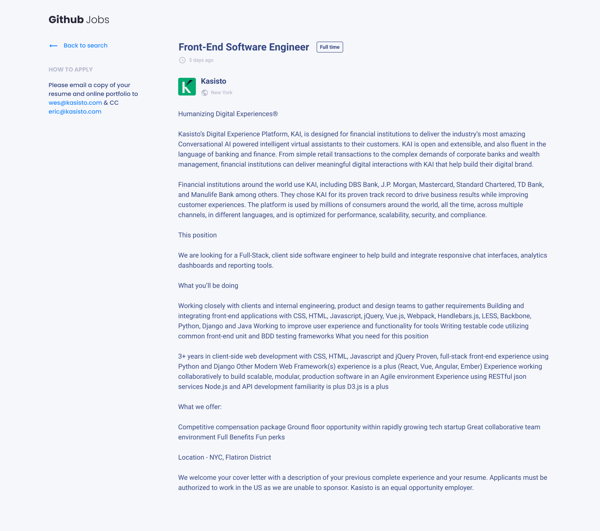
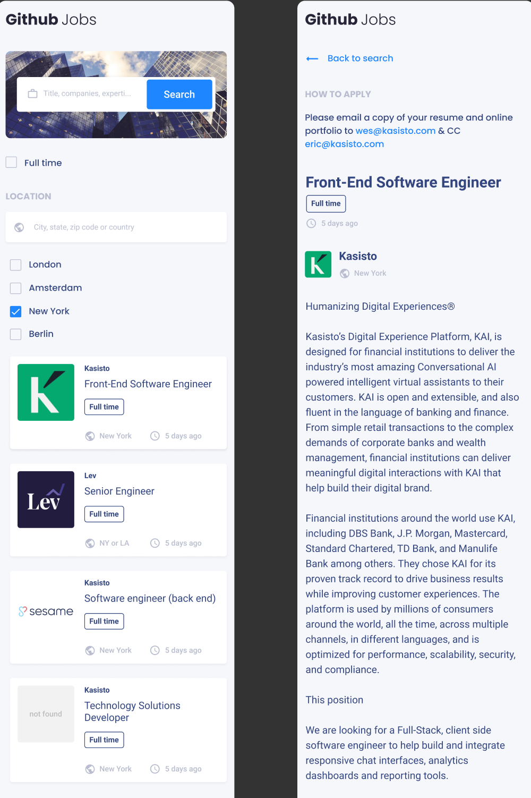

# Github Jobs

Here we are, the last graded project of this semester.

Your challenge: Create a job search using an API, and use React to handle the frontend. Don’t look at the existing solution. Fulfill user stories below:





- User story: I can see a list of jobs in a city by default
- User story: I can search for jobs with a given keyword
- User story: I can search for jobs with a city name, zip code or other location
- User story: I can select one option from at least 4 pre-defined options
- User story: I can search for a full-time job only
- User story: I can see a list of jobs with their logo, company name, location, and posted time.
- User story: When I select a job, I can see job descriptions and how to apply like the given design.
- User story: When I am on the job details page, I can go back to the search page
- User story (optional): I can see a list of jobs in the closest city from my location by default
- User story (optional): I can see jobs in different pages, 5 items each page

You’ll also have to apply a few concept we learned in class, such as a **reducer** and a global **context**. And there will be a bonus for those who can find a use case for a **compound component**.

**Icon**: https://google.github.io/material-design-icons/ (you can also use the react-icons package)

**API**: https://jobs.github.com/api. Use data from the API to create questions and answers.

*If you get some CORS errors, you can use https://cors-anywhere.herokuapp.com/ to help with accessing data from other websites that are normally forbidden by the same-origin policy of web browsers*

**Design** : https://www.figma.com/file/gAkVx9CdOqnJcCjJ7nVNkw

**Live app** : https://jolly-heisenberg-20c49e.netlify.app/

Once you completed, polish a nice readme submit your solutions on this link : https://forms.gle/Xg6kJMKmrBkyTe3TA, by providing URLs for both GitHub repository and live app on Netlify.

For the custom domain url you'll enter in netlify, please use the following naming convention : **github-jobs-_YOUR_FIRSTNAME_.netlify.app** (replace YOUR_FIRSTNAME by your firstname)

Good luck everybody!

Template for your readme :

<!-- Please update value in the {}  -->

<h1 align="center">{Your project name}</h1>

<div align="center">
  <h3>
    <a href="https://{your-demo-link.your-domain}">
      Demo
    </a>
    <span> | </span>
    <a href="https://{your-url-to-the-solution}">
      Solution
    </a>
  </h3>
</div>

<!-- TABLE OF CONTENTS -->

## Table of Contents

-   [Overview](#overview)
    -   [Built With](#built-with)
-   [Features](#features)
-   [How to use](#how-to-use)
-   [Contact](#contact)
-   [Acknowledgements](#acknowledgements)

<!-- OVERVIEW -->

## Overview


Introduce your projects by taking a screenshot or a gif. Try to tell visitors a story about your project by answering:

-   Where can I see your demo?
-   What was your experience?
-   In a few sentences, explain the structure of your project.
-   If you had more time, what area of your project would you improve?
-   Did you learn anything new while working on this project?
-   What was the most challenging part for you?
-   Any other comments?


### Built With

<!-- This section should list any major frameworks that you built your project using. Here are a few examples.-->

-   [React](https://reactjs.org/)

## Features

<!-- List the features of your application or follow the template. Don't share the figma file here :) -->

## How To Use

<!-- Example: -->

To clone and run this application, you'll need [Git](https://git-scm.com) and [Node.js](https://nodejs.org/en/download/) (which comes with [npm](http://npmjs.com)) installed on your computer. From your command line:

```bash
# Clone this repository
$ git clone https://github.com/your-user-name/your-project-name

# Install dependencies
$ npm install

# Run the app
$ npm start
```

## Acknowledgements

<!-- This section should list any articles or add-ons/plugins that helps you to complete the project. This is optional but it will help you in the future. For example: -->

## Contact

-   Website [your-website.com](https://{your-web-site-link})
-   GitHub [@your-username](https://{github.com/your-usermame})
